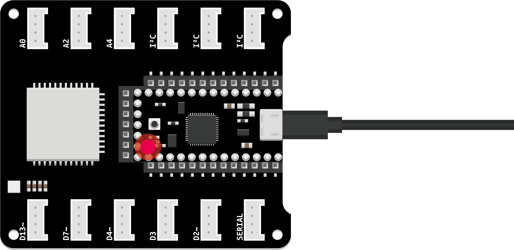

# Step 2: Connecting the ItsyBitsy to your computer
1. Take the USB cable from the Connected Interaction Kit and connect the ItsyBitsy to your computer. The ItsyBitsy will show up on your computer as a disk volume called `CIRCUITPY`. You should be able to see it in your Finder window (MacOS) or Explorer window (Windows).
2. Open Mu, click on `Load` in the toolbar at the top of Mu’s window, select the file `code.py` in the memory volume `CIRCUITPY`. We have already stored this program on the ItsyBitsy when we prepared your kit. This program makes your ItsyBitsy blink its internal LED.

```python
# Importing some libraries for time, controlling the board and digital input/outputs
import board # Learn more at https://learn.adafruit.com/circuitpython-essentials/circuitpython-pins-and-modules
import digitalio # Learn more at https://learn.adafruit.com/circuitpython-essentials/circuitpython-digital-in-out
import time

# Define a new variable and set D13 as an Output
LED = digitalio.DigitalInOut(board.D13)
LED.direction = digitalio.Direction.OUTPUT

# Usually code runs only once top to bottom until it is complete
# The function of "while True:" allows the code to run in a continous loop
# Everything indented with a tab is part of the function loop
while True:
	time.sleep(1.0) # Wait 1 second
	LED.value = True # Turn the LED on
	print("LED is on") # Add a status comment in the serial monitor
	
	time.sleep(1.0) # Wait 1 second
	LED.value = False # Turn the LED off
	print("LED is off") # Add a status comment in the serial monitor
	#The loop will start again after this line

```



You notice that some of the code (starting with a `#`) is greyed out. These commented sections are used for explanation, but will be skipped by the code and not influence our logic. 

The functional code without any comments looks like this:

```python
import board
import digitalio
import time 

LED = digitalio.DigitalInOut(board.D13)
LED.direction = digitalio.Direction.OUTPUT

while True:
    time.sleep(1.0)
    LED.value = True
    print("LED is on")
    
    time.sleep(1.0)
    LED.value = False
    print("LED is off")

```

You can download the full code file [here](assets/code.py).