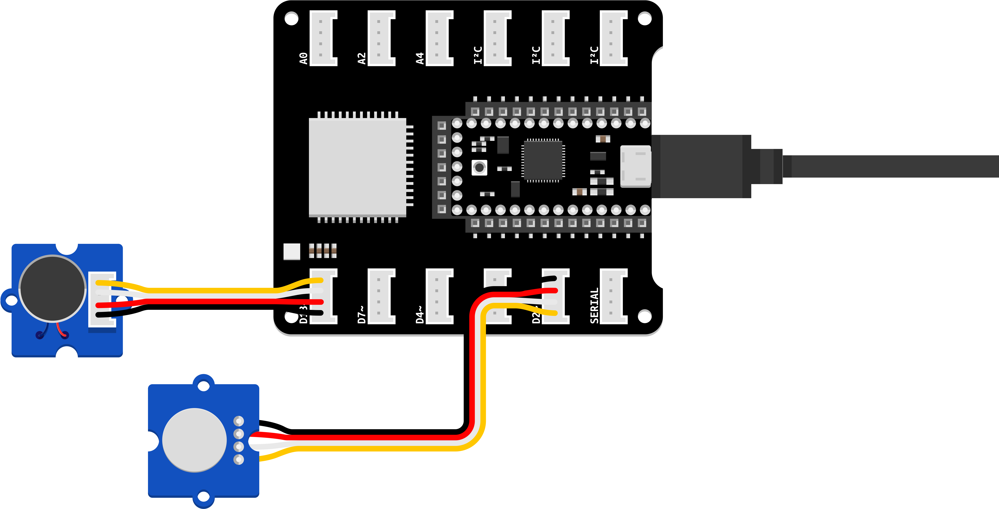

# Step 2: Connecting an output component

It is time to add the output component and finish your first interactive prototype!

1. Take the Vibration Motor (06) and a Grove cable (18) out of the box and connect it to pin `D13` of the Expander board, as shown in the illustration.



1. To work with the output component in the program you declare a variable and define it as an output.
2. Now recall the interaction design mentioned on page 10. You need to translate this design into Python statements. Luckily here it is straightforward by using an `if/else` statement. You turn the motor on or off depending on the current state of the touch sensor. In the condition part you read the Touch Sensor state (`sensor.value`) and in the remainder of the `if/else` you set the state of the motor to `True` or `False` (`motor.value`).
3. Save the file and try it out for yourself.
4. Try playing around with the program to change the behaviour of your prototype. You can also replace the output with a Piezo Buzzer (04) or the LED Pack (05) and see how the same program can be applied to them. You do not need to rename the motor variable - both new components operate in the same way.


```python
import board
import digitalio
import time
 

sensor = digitalio.DigitalInOut(board.D2)
sensor.direction = digitalio.Direction.INPUT

motor = digitalio.DigitalInOut(board.D13)
motor.direction = digitalio.Direction.OUTPUT

while True:
    print(sensor.value)
    if sensor.value is True:
        motor.value = True
    else:
        motor.value = False
    time.sleep(0.1)
```