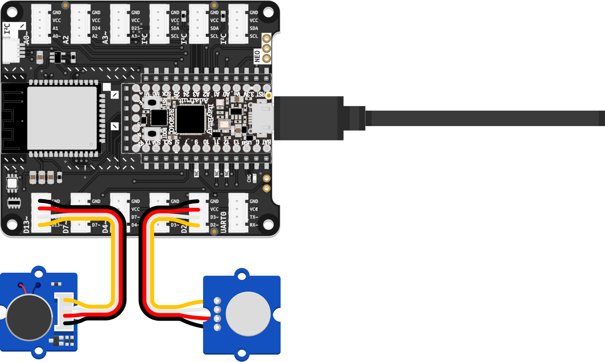

# Part 2 - Add an Output Component

Now that your prototype can register a user input, it is time to tie it together by adding your output component.




1. As with the Touch Sensor, begin by connecting your Vibration Motor using a Grove cable. Connect it to pin **`D13`**, as shown in the illustration.
2. As before, you need a variable to hold data to make your component work. Make sure to give it a sensible name, such as `motor`. This time, instead of reading a value from a sensor, you will use the variable to write data to an actuator. The statements needed for the vibration motor will look very similar to the ones you wrote for the touch sensor, with one critical difference: As shown in the following example, the `digitalio.Direction` is set to `OUTPUT`.
3. As you recall, the goal is to make the motor vibrate for as long as the sensor registers a touch. If the sensor is not touched, no vibration should be created. CircuitPython provides a handy way to translate this idea into code using `if...else statements` ([conditional statements](../../glossary/glossary)). An `if statement` executes a block of code only if a specified condition is `True`. An `else clause` can be added to run another set of instructions should the condition be false.
4. You can use this knowledge to turn the motor on and off, depending on the current state of the touch sensor. If `sensor.value is True:`, the motor can be turned on with `motor.value = True`. Else, the motor needs to be turned off again. Remember to save your code to see it in action.
5. Try experimenting with the code to change the behavior of your prototype. See how programmed behavior is affected by using the Piezo Buzzer as an actuator instead of the motor.

```python
import board
import digitalio
import time

sensor = digitalio.DigitalInOut(board.D2)
sensor.direction = digitalio.Direction.INPUT

motor = digitalio.DigitalInOut(board.D13)
motor.direction = digitalio.Direction.OUTPUT

while True:
    print(sensor.value)
    if sensor.value is True:
        motor.value = True
    else:
        motor.value = False
    time.sleep(0.1)
```

{:.highlight}
It is advisable to regularly back up the code stored on the `CIRCUITPY` drive to your computer. That way, you have something to fall back on should a memory loss occur or your ItsyBitsy is misplaced.

[Next Tutorial](../connecting-to-the-internet/){: .btn .btn-blue }